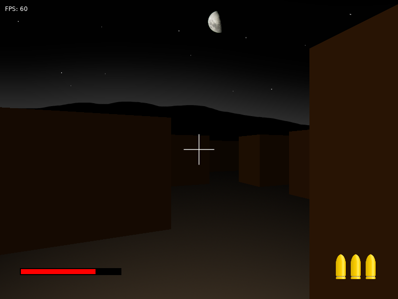

# dungeon

This is a dungeon crawler game. It is written in lua and uses the löve 2D game engine. The 3D projection is done on the CPU.

## Your goal
Find and activate the three red switches in each level to unlock the goal. Beware of the killer robots.

## Controls
* Move: arrow keys
* Turn: mouse
* Fire: left mouse button
* Reload: right mouse button
* Quit: Escape
* Toggle fullscreen: f
* Toggle mouse grab: Tab

## How to run

1. install the [löve game engine](https://love2d.org/)
2. run "love ." in the base directory (the dot is important because löve needs the directory that contains main.lua as its first argument

